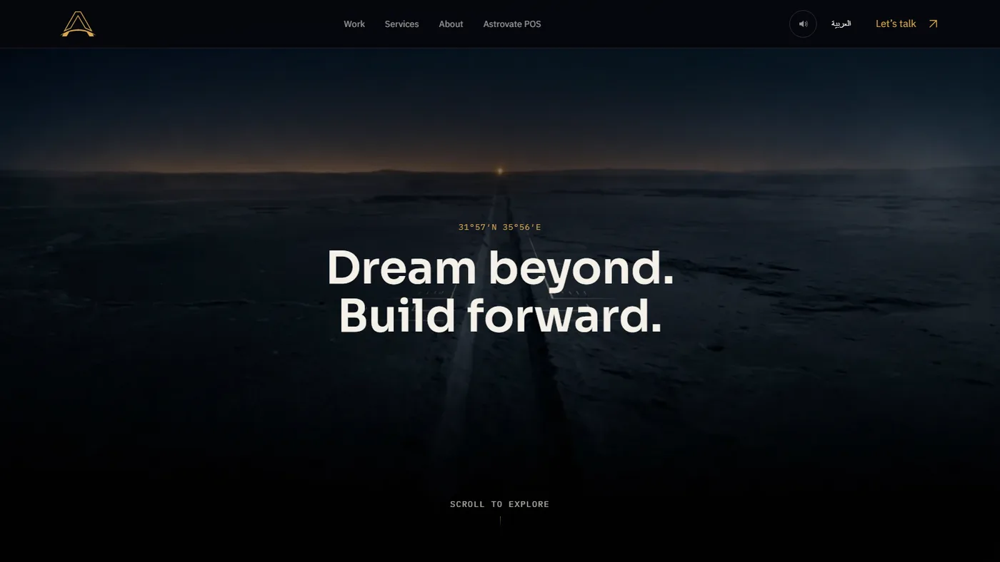

 

### About me

I run **[Astrovate](https://astrovate.space)**, a creative technology studio in Amman — strategy, design and engineering under one roof, bilingual Arabic/English by default. Day to day that means shipping full‑stack products end to end: from a cinematic Next.js marketing site with a real 3D solar system, to an offline‑first Windows POS built on Electron and SQLite, to dozens of client sites across hospitality, healthcare, education, events and retail.

- 🛠️ Currently building **Astrovate POS** — offline‑first checkout, inventory and reporting for small supermarkets
- 🌍 Everything I ship supports Arabic (RTL) and English from day one, not as an afterthought
- 📈 40+ repositories of real client work, most private by client agreement — see **Selected work** below for the live sites
- 💬 Ask me about **Next.js, TypeScript, Electron desktop apps, or bilingual/RTL product design**
- ⚡ Fun fact: I've shipped everything from wedding invitation experiences to point-of-sale systems in the same month

 

  
  astrovate.space — cinematic homepage, bilingual, real Three.js solar system

 

### 🗂️ Selected work

<table>
<tr>
<td width="50%">

 <b>Borscht Bureau</b> · Hospitality
 One restaurant. Two moods. A world of its own.
</td>
<td width="50%">

 <b>SHTROM Creative</b> · Creative & marketing
 A bold digital presence for a creative voice.
</td>
</tr>
<tr>
<td width="50%">

 <b>Jalsat Tahaddi</b> · Games & entertainment
 Turn a gathering into a game worth remembering.
</td>
<td width="50%">

 <b>ZSkills</b> · Learning & community
 A place to discover, learn, and connect.
</td>
</tr>
<tr>
<td width="50%">

 <b>Tomaninah</b> · Healthcare
 A clearer path through healthcare.
</td>
<td width="50%">

 <b>YoYo Burgers</b> · Food & beverage
 Big appetite. Bigger personality.
</td>
</tr>
<tr>
<td width="50%">

 <b>Mohammad Hussein</b> · Personal portfolio
 A filmmaker's work, given the whole screen.
</td>
<td width="50%">

 <b>Astrovate POS</b> · Retail operations
 From the first scan to the last receipt. Our own product.
</td>
</tr>
</table>

Most client repositories are private under NDA — the live sites above are the real, current, deployed product. Screenshots are genuine captures, not mockups.

 

### 🛠️ Tech stack

**Languages**
 

**Frontend**
 

**Backend & data**
 

**Desktop & tools**
 

 

### 📊 GitHub stats

 

 

  <picture>
    <source media="(prefers-color-scheme: dark)" srcset="https://raw.githubusercontent.com/alaa-talab/alaa-talab/output/github-contribution-grid-snake-dark.svg" />
    <source media="(prefers-color-scheme: light)" srcset="https://raw.githubusercontent.com/alaa-talab/alaa-talab/output/github-contribution-grid-snake.svg" />
    
  </picture>

 

### 🤝 Connect

